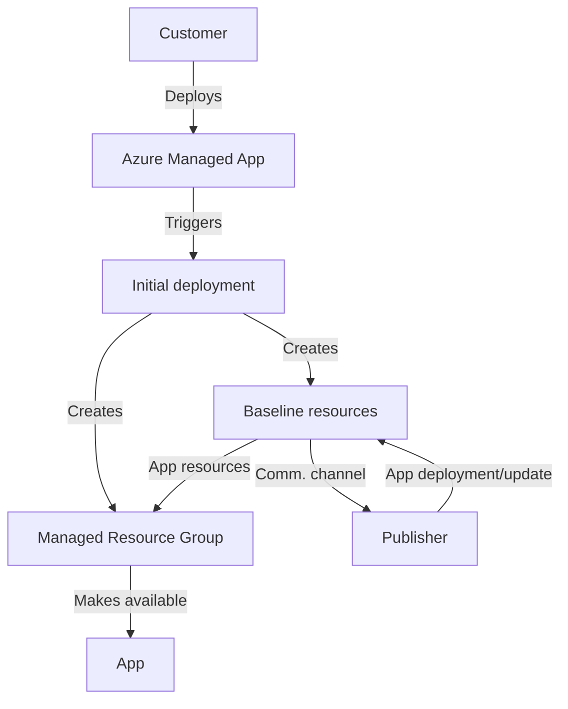
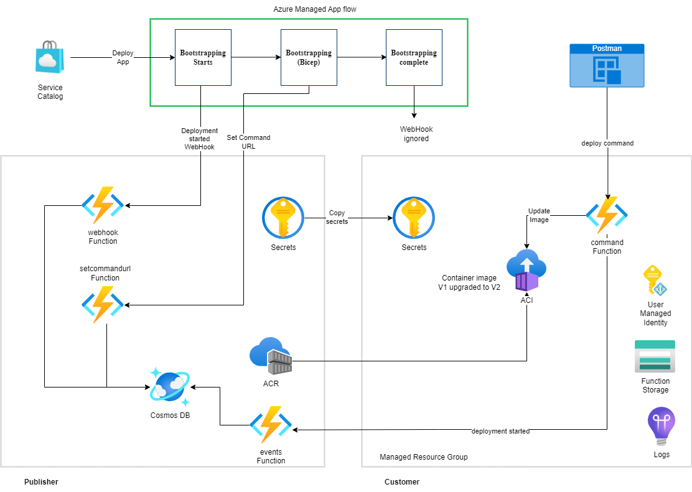

# Azure Managed Application Updating Sample

## Description

This sample demonstrates how to create an [Azure Managed Application](https://learn.microsoft.com/en-us/azure/azure-resource-manager/managed-applications/overview) with a link to a publisher's backend to be able to receive commands to update the managed application using docker containers with IaC code running in the context of the Managed Resource Group.

## Business problems and challenges

Azure Managed Applications allow Independent Software Vendors (ISVs) to distribute Azure-based solutions as a single package, via a Service Catalog (internally) and via the Azure Marketplace (externally). Application developers must implement a mechanism to update Azure Managed Applications once they have been deployed. One thing to be conscious of is that once a version of the solution is deployed, the only way to get an updated version is to remove it from the subscription and re-adding the updated version.

## Solution

A possible way to tackle both the application and infrastructure upgrading issue is to split the application deployment into two phases:

- The initial deployment of the baseline resources to establish a communication channel between the deployed solution and the publisher.
- The deployment of the application itself, which will be updated independently from the baseline resources.

This approach allows the publisher to update the application without affecting the baseline resources. Those resources are the ones that are required to establish a communication channel between the deployed solution and the publisher. This communication channel can be used to monitor the deployed solution and to provide the publisher with the means to apply updates to the application without requiring user intervention.

The following diagram shows a high-level flow of the solution:



A relatively simple way to establish a communication channel between the deployed solution and the publisher is to use an HTTP endpoint. This endpoint could be an HTTP-triggered [Azure Function](https://docs.microsoft.com/en-us/azure/azure-functions/functions-overview) that is deployed as part of the baseline resources and that is responsible for receiving and processing the application and infrastructure update requests, using an identity that has the necessary permissions to perform the required operations.

In a similar manner, the publisher could also use an HTTP-triggered Azure Function listening for requests coming from the deployed solution. This could be used to notify the publisher of any issues or to provide the publisher with any telemetry data.

### Solution components

The solution is composed of the following components:

- Publisher's backend:
  - A `deployment` function, used to trigger the deployment of a new version of the application for an already deployed Azure Managed Application.
  - A `webhook` function that is triggered when a new Azure Managed Application instance is deployed. This function will create an entry in a Cosmos DB database containing the `applicationId` of the deployed Azure Managed Application instance.
  - `setcommandurl` function that is triggered when a new Azure Managed Application instance is deployed. This function will update the `commandUrl` property of the Cosmos DB record with the URL and key of the `commands` function deployed in the Managed Resource Group.
  - `events` function used to receive events from the deployed Azure Managed Applications.

  - Azure Managed Application deployment:
    - A `commands` function that is deployed in the Managed Resource Group. This function will be invoked by the publisher's backend to update the deployed Azure Managed Application instance.

## Prerequisites

- Azure Subscription
- Azure CLI
- Docker
- Appliance Resource Provider Object Id (it can be retrieve searching for "Appliance Resource Provider in the Azure Portal, in the Active Directory section)

> If you are using WSL on Windows, make sure the _zip_ command is available. You can install it by issuing this command-line _sudo apt install zip_.

## Repository Structure

```bash
ama-update-sample
├── .devcontainer               # devcontainer configuration
├── .vscode                     # vscode configuration
├── ama                         # Azure Managed Application components
│   └── commands                # "commands" function to be deployed in the Managed Resource Group    
│   ├── definition              # Azure Managed Application definition (bicep + json templates)
│   └── resources               # Docker image with IaC code to be deployed in the Managed Resource Group
├── publisher                   # Publisher's backend components
│   ├── deployment              # "deployment" function to be deployed in the publisher's backend
│   ├── events                  # "events" function to be deployed in the publisher's backend
│   ├── setcomandurl            # "setcommandurl" function to be deployed in the publisher's backend
│   ├── webhook                 # "webhook" function to be deployed in the publisher's backend
│   └── iac                     # IaC code to deploy the publisher's backend
└── utils                       # Utility classes used by all the functions
```

## Deploying the publisher's backend and the Azure Managed Application definition

To deploy the publisher's backend and the Azure Managed Application definition, you need to run the following commands in the root folder of the repository:

```bash
export RESOURCE_GROUP_NAME=<resource group name>
export LOCATION=<location>
export APPLIANCE_RESOURCE_PROVIDER_OBJECT_ID=<object id>

./deploy.sh
```

This will create a resource group with the name specified in the RESOURCE_GROUP_NAME environment variable, and deploy all the resources in that resource group. It will also create an Azure Managed Application definition called `ama-update-sample` in the service catalog.




## Deploying the Azure Managed Application

Instances of the Azure Managed Application can be created using the `az` CLI or the Azure Portal.

During the deployment, the publisher's backend will be notified of the deployment, and the `webhook` function will be triggered. This function will create an entry in the deployed Cosmos DB database containing the deployment `applicationId`.

The last phase of the deployment will invoke the `setcommandurl` function, which will update the `commandUrl` property of the Cosmos DB record with the URL and key of the `commands` function deployed in the Managed Resource Group.

## Updating an Azure Managed Application instance

To update an Azure Managed Application instance, you can send a POST request to the `deployment` function deployed in the publisher's backend. The body of the request should be a json with the `applicationId` of the Azure Managed Application instance to be updated, and the full name of the docker image to deploy in the `image` field. During the backend deployment phase, a sample image was deployed in the publisher's backend, so you can use that image for the update. The image is `<prefix>acr.azurecr.io/ama-update-sample-resources:<tag>` and can be found in the publisher's Container Registry.

Here is an example of the JSON message for the POST request:

```json
{
    "applicationId":"subscriptionsaf4cbd2f-24f1-408a-9945-c7594b98c964resourcegroupspabloprovidersmicrosoft.solutionsapplicationsmyupdatableapp",
    "image": "abecaxkqnyv7qh6acr.azurecr.io/ama-update-sample-resources:1673630025"
}

```

When a new deployment is triggered in the Managed Resource Group, the `events` function will be triggered. This function will add a new entry in the Cosmos DB database with the `applicationId` and the `image` of the deployment.

> This step is invoked manually via a Postman tool in this tutorial, but in an actual deployment system, it would be automatically called from the Publisher's backend, called when a new version of the container image is available.

## Cleaning up the publisher's backend

To delete all the deployed resources, you can run the following command:

```bash
# by default, it will pick up the resource group name used in the deployment
# To override it, you can export the RESOURCE_GROUP_NAME environment variable
./cleanup.sh
```
